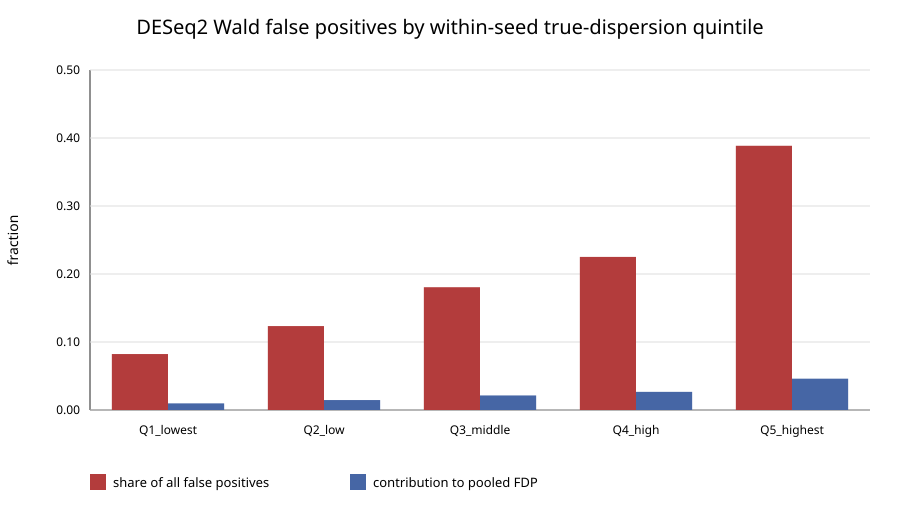
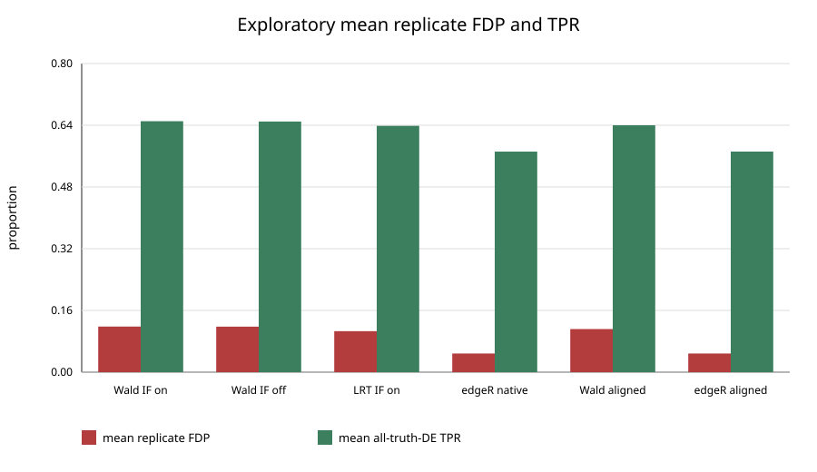

# DESeq2 compcodeR calibration-failure mechanism diagnostic

## Scope

This is a read-only, hypothesis-generating diagnostic of the disclosed exploratory seeds 61001–61020. It is not certification evidence and does not change any gate threshold or DESeq2 setting. Its declared inputs and executable seed enumeration contain only the exploratory grid; because the simulation seeds are public and deterministic, historical non-viewing of other seeds cannot be cryptographically proved.

The diagnostic is bound to exploratory report SHA-256 `927b94001028182c94664b831570232aa3157b375783fe736b743a7fd42e7c2a`. Each fixture was regenerated and matched to that report before analysis. The adjacent JSON is the authoritative machine record; this Markdown is a deterministic derived view.

## Dispersion fit

DESeq2 requested the parametric dispersion trend in 20/20 replicates. The resolved fit counts were `WALD {'parametric': 20}; LRT {'parametric': 20}`; automatic fallback occurred in 0 replicates. Because no fallback was observed, a fallback-effect contrast is not estimable from this seed grid.

A resolved parametric curve with finite positive coefficients establishes numerical completion, not dispersion-model adequacy or causality for false discoveries.

The simulator true-dispersion tail above DESeq2's maxDisp=12.0 contains 185 truth-null genes; 81 were published-tested and 8 were false positives.

Final-to-true dispersion ratios:

| Group | Genes | Median | Q25 | Q75 | Fraction below 1 |
| --- | ---: | ---: | ---: | ---: | ---: |
| all genes | 99982 | 1.07771 | 0.80437 | 1.43110 | 0.43130 |
| truth null | 89983 | 1.07779 | 0.80441 | 1.43083 | 0.43129 |
| truth de | 9999 | 1.07683 | 0.80404 | 1.43447 | 0.43134 |
| null false positive | 875 | 0.59178 | 0.44980 | 0.79285 | 0.91657 |
| null not called | 89108 | 1.08324 | 0.80987 | 1.43524 | 0.42653 |

The false-positive row conditions on the observed outcome and is therefore selection-biased. Its contrast with uncalled null genes is hypothesis-generating association, not a causal estimate.

## False positives by true dispersion

Equal-count quintiles are formed independently within each seed by ranking true dispersion with gene_id as a deterministic tie-break. They never use fitted statistics, calls, P values, or observed-result ranks. `Null false-positive rate` is FP / published-tested truth-null genes after independent filtering in the stratum. `FP share` is FP / all false positives. `Pooled-FDP contribution` is FP / all discoveries and is not mislabeled as a within-stratum FDP.

| Within-seed quintile | Null raw-testable | Null published-tested | False positives | Null false-positive rate | FP share | Pooled-FDP contribution |
| --- | ---: | ---: | ---: | ---: | ---: | ---: |
| Q1_lowest | 18083 | 18031 | 72 | 0.00399 | 0.08229 | 0.00976 |
| Q2_low | 17905 | 17897 | 108 | 0.00603 | 0.12343 | 0.01463 |
| Q3_middle | 18046 | 18026 | 158 | 0.00877 | 0.18057 | 0.02141 |
| Q4_high | 18032 | 17969 | 197 | 0.01096 | 0.22514 | 0.02669 |
| Q5_highest | 17429 | 17080 | 340 | 0.01991 | 0.38857 | 0.04607 |

Per-seed concentration ranges:

| Quintile | Mean FP | FP range | Mean null FPR | Null FPR range |
| --- | ---: | ---: | ---: | ---: |
| Q1_lowest | 3.60 | 0–8 | 0.00400 | 0.00000–0.00886 |
| Q2_low | 5.40 | 1–9 | 0.00603 | 0.00111–0.01001 |
| Q3_middle | 7.90 | 2–12 | 0.00877 | 0.00221–0.01335 |
| Q4_high | 9.85 | 4–15 | 0.01095 | 0.00444–0.01665 |
| Q5_highest | 17.00 | 3–29 | 0.01993 | 0.00345–0.03326 |

## Method diagnostics

| Analysis | Mean tested | Mean replicate FDP | Pooled FDP | Mean all-truth-DE TPR | Mean conditional TPR in tested family |
| --- | ---: | ---: | ---: | ---: | ---: |
| deseq2 wald independent filtering on | 4943.8 | 0.11821 | 0.11856 | 0.65050 | 0.65911 |
| deseq2 wald independent filtering off | 4971.9 | 0.11797 | 0.11833 | 0.64970 | 0.65341 |
| deseq2 lrt independent filtering on | 4943.4 | 0.10623 | 0.10649 | 0.63850 | 0.64648 |
| edger ql native | 4469.1 | 0.04834 | 0.04859 | 0.57170 | 0.64057 |
| deseq2 wald aligned common tested family | 4463.4 | 0.11172 | 0.11197 | 0.64000 | 0.71821 |
| edger ql aligned common tested family | 4463.4 | 0.04833 | 0.04859 | 0.57180 | 0.64172 |

Independent filtering is compared using the same Wald fit and the same Cook's-cutoff behavior; only `independentFiltering` changes. Wald and LRT use the same counts, design, size-factor/dispersion settings, and seed. The LRT tests the omnibus full `~ condition` versus reduced `~ 1` hypothesis.

Pooled Wald/LRT call overlap (descriptive only):

| Truth scope | Both | Wald only | LRT only | Neither | Jaccard |
| --- | ---: | ---: | ---: | ---: | ---: |
| all | 7144 | 236 | 2 | 92618 | 0.96776 |
| null | 761 | 114 | 0 | 89125 | 0.86971 |
| DE | 6383 | 122 | 2 | 3493 | 0.98094 |

For the aligned edgeR comparison, both raw-P families are restricted to the intersection of finite DESeq2 Wald P values and genes retained by edgeR `filterByExpr`; BH is then recomputed separately for each method on those identical gene IDs. Native results are retained only as unaligned context.

## Interpretation boundary

These 20 seeds may generate hypotheses about the observed calibration failure. They cannot establish a new applicability boundary, support changing a gate, or certify either method. The self-attested synthetic matrix also does not authenticate featureCounts provenance. No held-out artifacts are declared or consumed by this diagnostic; opening a held-out route still requires a separate user decision.
